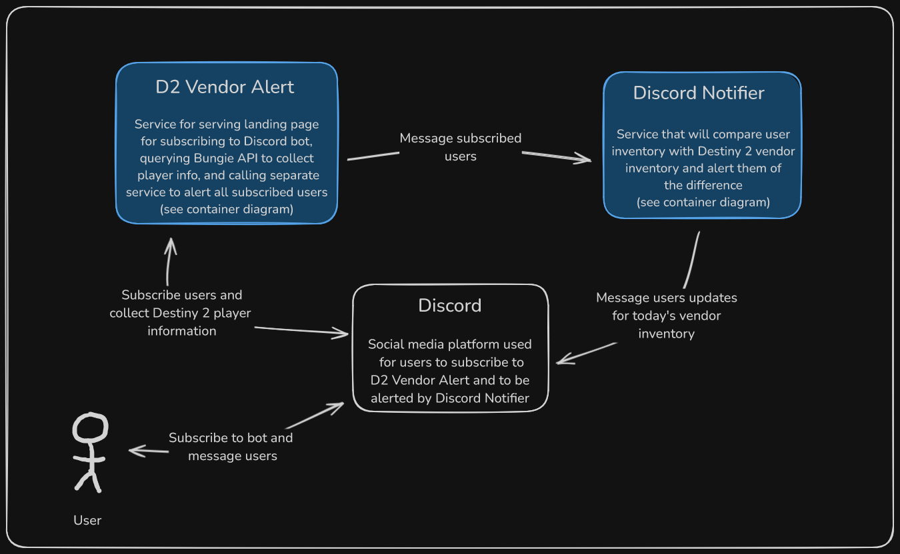

# Context Diagram

This diagram illustrates the high-level perspective of the project. There are two services in the monorepo, D2 Vendor Alert and Discord Notifier. A user will interact with them through Discord via a bot. The Discord bot needs to be authorized for a Discord server and then the user will be able to subscribe to the service through a slash command "/alert". Once subscribed, the D2 Vendor Alert service will handle running a landing page for the OAuth flow of authorizing Bungie's API. It will also call the Discord Notifier service to send a message on a daily basis.
