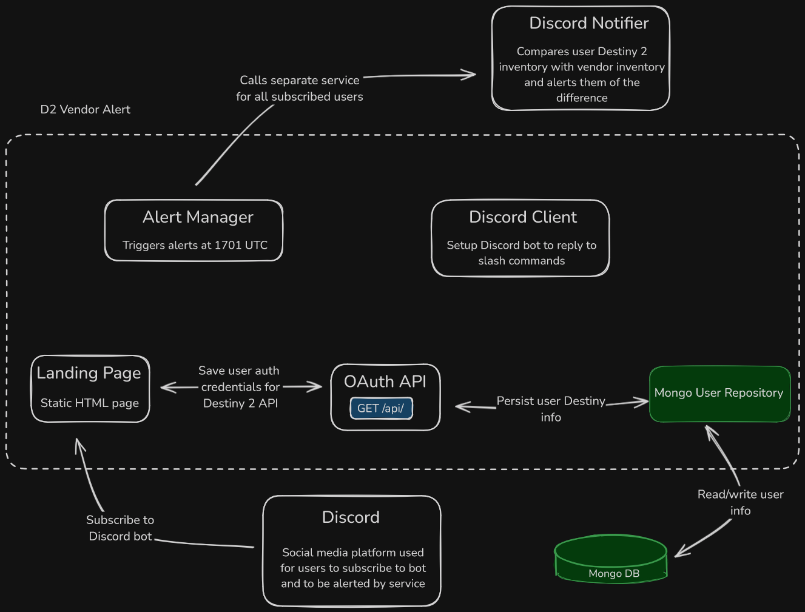

# D2 Vendor Alert Diagram

This diagram portrays a more detailed depiction of the D2 Vendor Alert service. This service has three key points: OAuth flow, Alert Manager, and the Discord Client.

&emsp;The OAuth flow is when a user subscribes to the Discord bot to authorize the application to make requests on their behalf to the Bungie API for Destiny 2. After the user authorizes the app, they will be redirected to a landing page that's hosted by D2 Vendor Alert. This landing page will capture the user's authorization code and persist it as well as some other Destiny 2 related information in a Mongo database.

&emsp;Alert Manager is a component in D2 Vendor Alert that is responsible for calling the Discord Notifier service at 1701 UTC, a separate call is made for each user.

&emsp;Discord Client is also a component in D2 Vendor Alert. It is important because when the service starts, it will setup the Discord bot and will listen for slash commands and reply to them as necessary.
