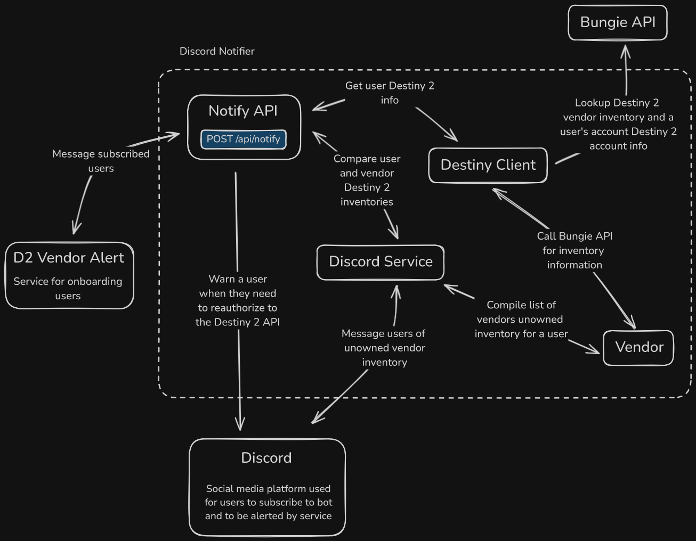

# Discord Notifier

This diagram depicts the Discord Notifier service in greater detail. When the D2 Vendor Alert service makes a POST call to Discord Notifier, there are two separate flows that get triggered. The first is a check on the requested user's Bungie API refresh token and if it's expired, then warn them. The second flow will query the Bungie API to collect the inventory information for the requested user and collect the inventory information for the Destiny 2 vendor. These two inventories are then compared and their difference is messaged to the user.
